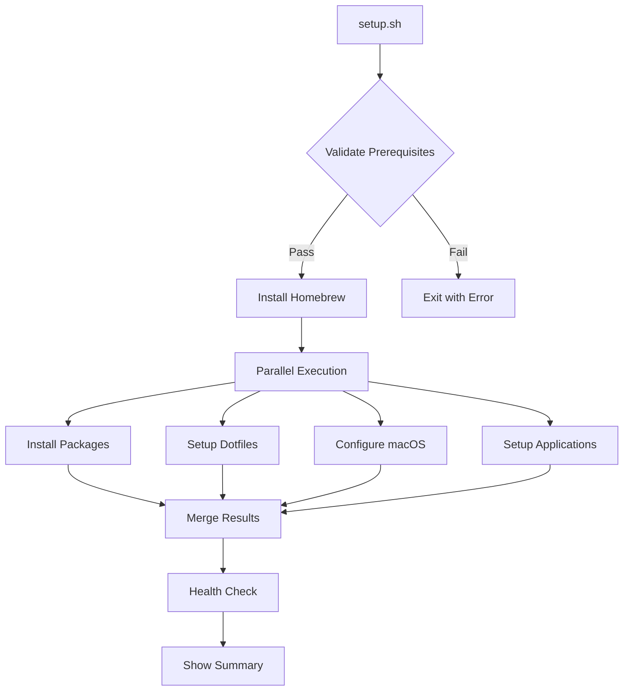

# Architecture & Design

Technical details about how this setup works.

## Repository Structure

```
macbook-dev-setup/
├── setup.sh                    # Main setup script (parallel execution)
├── setup-validate.sh           # Fast validation/dry-run script
├── lib/
│   ├── common.sh              # Shared functions and utilities
│   └── config.sh              # Configuration parser
├── scripts/
│   ├── install-*.sh           # Component installers
│   ├── setup-*.sh             # Configuration scripts
│   ├── health-check.sh        # System verification
│   ├── update.sh              # Update automation
│   ├── pre-push-check.sh      # Git pre-push validation
│   └── setup-branch-protection.sh # GitHub branch rules
├── dotfiles/
│   ├── .zshrc                 # Modular shell config loader
│   ├── .gitconfig             # Git configuration
│   └── .config/
│       ├── zsh/               # Modular Zsh configs
│       └── nvim/              # Neovim configuration
├── homebrew/
│   ├── Brewfile               # Main package definitions
│   └── Brewfile.minimal       # Essential packages only
├── vscode/
│   ├── settings.json          # VS Code settings
│   └── extensions.txt         # Extension list
├── tests/
│   ├── run_tests.sh           # Test runner
│   ├── test_framework.sh      # Test utilities
│   └── test_*.sh              # Test suites
└── docs/                       # Documentation
```

## Design Principles

### 1. Performance First

**Parallel Execution:**
- Uses `$(nproc)` to determine CPU cores
- Runs independent tasks concurrently
- 30-50% faster than sequential execution

**Smart Delegation:**
- `setup.sh --dry-run` delegates to `setup-validate.sh`
- Validation script skips unnecessary operations
- 6x faster for dry runs

**Caching:**
- Homebrew prefix cached in shell startup
- NVM lazy-loaded to improve shell speed
- Package checks before installation

### 2. Safety & Reliability

**Validation:**
- Prerequisites checked before execution
- Dry-run mode for preview
- Comprehensive error handling

**Backups:**
- Automatic restore points
- Dotfiles backed up before replacement
- Rollback capability

**Idempotency:**
- Scripts can be run multiple times safely
- Checks for existing installations
- Skips already-configured items

### 3. Modularity

**Component Scripts:**
- Each script handles one responsibility
- Can be run independently
- Share common library functions

**Configuration:**
- Zsh config split into logical modules
- Easy to disable/modify components
- Local overrides supported

### 4. User Experience

**Progress Feedback:**
- Color-coded output messages
- Progress bars for long operations
- Clear success/failure indicators

**Documentation:**
- Comprehensive help messages
- Inline documentation
- Troubleshooting guides

## Core Components

### setup.sh

Main orchestrator that:
1. Validates environment
2. Installs Homebrew
3. Runs component scripts in parallel
4. Reports results

Key features:
- Flag parsing with multiple options
- Performance monitoring
- Logging support

### setup-validate.sh

Lightweight validation script that:
1. Checks prerequisites
2. Validates configurations
3. Previews changes
4. Never modifies system

Optimizations:
- Minimal imports
- Skip expensive operations
- Fast file checks only

### lib/common.sh

Shared library providing:
- Color output functions
- OS/architecture detection
- Error handling
- Progress indicators
- Backup utilities

Used by all scripts for consistency.

## Installation Flow



## Performance Optimizations

### Parallel Processing

```bash
# Execute multiple commands concurrently
execute_parallel() {
    local pids=()
    for cmd in "$@"; do
        eval "$cmd" &
        pids+=($!)
    done
    
    # Wait for all processes
    for pid in "${pids[@]}"; do
        wait "$pid"
    done
}
```

### Lazy Loading

NVM optimization in `.config/zsh/10-languages.zsh`:
```bash
# Define stub functions
nvm() {
    unset -f nvm node npm npx
    source "$NVM_DIR/nvm.sh"
    nvm "$@"
}
```

### Brew Optimization

```bash
# Disable auto-update during installation
export HOMEBREW_NO_AUTO_UPDATE=1

# Skip cleanup during batch operations
export HOMEBREW_NO_INSTALL_CLEANUP=1
```

## Configuration System

### Modular Zsh

Files loaded in order:
1. `00-*` - Core setup (Homebrew, paths)
2. `10-*` - Language managers
3. `20-*` - Tool configurations
4. `30-*` - Aliases
5. `40-*` - Functions
6. `50-*` - Environment
7. `90-99` - Local overrides

### Profile Support

```yaml
# config/setup.yaml
profiles:
  default:
    include_all: true
  minimal:
    brew:
      brewfile: "homebrew/Brewfile.minimal"
  custom:
    brew:
      additional:
        - my-tool
```

## Error Handling

### Graceful Degradation

```bash
# Try preferred method, fall back if needed
if ! brew bundle; then
    warning "Brew bundle failed, trying individual installs"
    install_packages_individually
fi
```

### User-Friendly Errors

```bash
# Clear error messages with solutions
if ! command_exists git; then
    error "Git is not installed"
    info "Install Xcode Command Line Tools:"
    info "  xcode-select --install"
    exit 1
fi
```

## Testing Strategy

### Unit Tests
- Test individual functions
- Mock external commands
- Verify error handling

### Integration Tests
- Test script interactions
- Verify file creation
- Check idempotency

### CI/CD Pipeline
- Run on every push
- Test on macOS runners
- Validate documentation

## Security Considerations

### No Hardcoded Secrets
- Secrets in `99-local.zsh` (gitignored)
- Environment variables for sensitive data
- Secure credential storage

### Download Verification
- HTTPS for all downloads
- Checksum verification where possible
- Official sources only

### Permission Management
- Minimal sudo usage
- Clear permission requirements
- User consent for changes

## Extension Points

### Custom Scripts

Add to `scripts/` directory:
```bash
#!/bin/bash
source "$(dirname "$0")/../lib/common.sh"

# Your custom logic
```

### Package Additions

Edit `homebrew/Brewfile`:
```ruby
# Your tools
brew "your-tool"
cask "your-app"
```

### Configuration Overrides

Use `~/.config/zsh/99-local.zsh`:
```bash
# Override defaults
export EDITOR="code"
alias ls="ls -la"
```

## Future Enhancements

### Planned Features
- Configuration profiles UI
- Automated testing expansion
- Plugin system for extensions
- Cross-platform support (Linux)

### Performance Goals
- Sub-10 minute full installation
- Instant shell startup (<100ms)
- Zero-downtime updates

### Architecture Evolution
- Move to configuration as code
- Container-based testing
- Self-updating capability